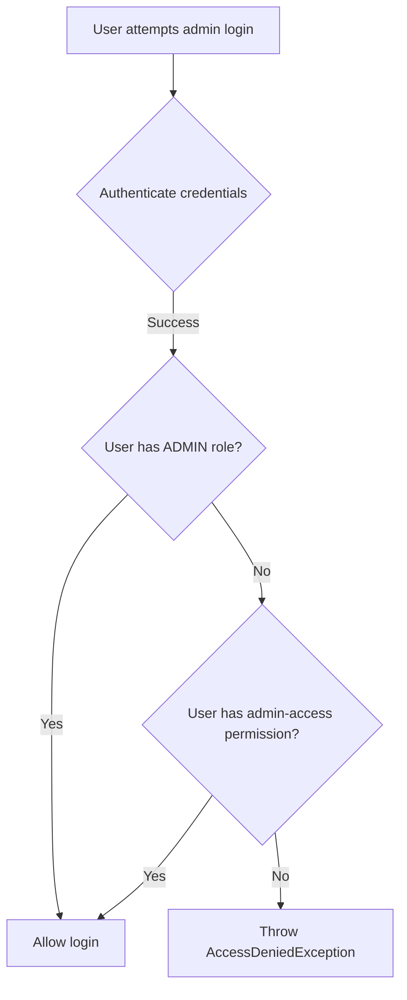

# Plan: Admin Login Permission Validation

## Objective
Modify the admin login to validate for the `admin-access` permission in addition to (or instead of) just checking the ADMIN role. The validation should pass if the user has **either** the ADMIN role **OR** the admin-access permission.

## Background
- The database already has the `admin-access` permission seeded (line 148 in `001-initial-schema.sql`)
- The permission is assigned to the ADMIN role (lines 149-152)
- Currently, `AdminAuthService.java` only checks for the ADMIN role (lines 54-59 and 99-104)

## Implementation Plan

### 1. Modify AdminAuthService.java

**File:** `src/main/java/lk/helphub/api/application/services/AdminAuthService.java`

**Changes Required:**

1. **Add a private helper method** `hasAdminAccess(User user)` that checks:
   - If user has ADMIN role (existing check)
   - OR if user has admin-access permission via their roles

2. **Update `loginAdmin` method** (around lines 54-59):
   - Replace the role-only check with the new helper method

3. **Update `verify2fa` method** (around lines 99-104):
   - Replace the role-only check with the new helper method

### Helper Method Logic

```java
private boolean hasAdminAccess(User user) {
    // Check if user has ADMIN role
    boolean hasAdminRole = user.getRoles().stream()
            .anyMatch(role -> "ADMIN".equals(role.getName()));
    
    if (hasAdminRole) {
        return true;
    }
    
    // Check if user has admin-access permission via any of their roles
    return user.getRoles().stream()
            .flatMap(role -> role.getPermissions().stream())
            .anyMatch(permission -> "admin-access".equals(permission.getSlug()));
}
```

### Mermaid Flow Diagram



## Files to Modify
- `src/main/java/lk/helphub/api/application/services/AdminAuthService.java`

## Testing Considerations
- Test login with user having ADMIN role only
- Test login with user having admin-access permission only
- Test login with user having both ADMIN role and admin-access permission
- Test login with user having neither (should fail)
